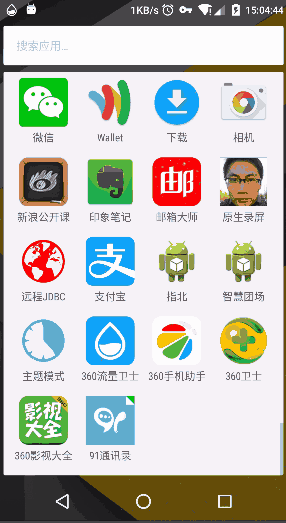

2016.1.3发布于oschina<br/>
关于安卓手机录制屏幕视频的段子已经很多了，本文仅属懒鱼充数。
一直以来android都没有为此提供官方 api，直到5.0里有了 MediaProjection 好像可以实现，但也只见介绍没见实例。而4.4里提供了一个 screenrecord 可以录制屏幕，即使手机未 root，当开启 usb 调试后，仍然可以通过 adb shell 在PC上实现录制。
问题是，如何在手机应用中实现录制？否则，这个功能的累赘太大了。<br/>
 
<br/>
先来看下Android 4.4提供的screenrecord命令。
1.PC端执行adb shell screenrecord命令
===================================
    示例：
    adb shell screenrecord /sdcard/abc.mp4
    这行命令表示录制屏幕并将视频保存为SD卡中的abc.mp4文件。
    
    screenrecord除了必须直接指定目标视频文件，还有以下常用参数：
        --size
        示例：adb shell screenrecord --size 1280x720 /sdcard/abc.mp4
        设置视频的尺寸。默认是设备的主屏幕分辨率大小，如果不支持，默认使用“1280x720”。此参数可忽略。
        --bit-rate
        示例：adb shell screenrecord --bit-rate 100000 /sdcard/abc.mp4
        设置视频的比特率。参数范围为[100000,100000000]，默认是4Mbps，即4000000。此参数可忽略。
        --time-limit
        示例：adb shell screenrecord --time-limit 10 /sdcard/abc.mp4
        设置视频最长录制时间，单位s。默认最长为180秒。此参数可忽略。
        如果不指定此参数，screenrecord进程会在录制180秒后自动终止；指定了即录制指定秒后终止。如果想在录制结束前终止，Ctrl+c 。
        --verbose
        示例：adb shell screenrecord --rotate 30 --verbose /sdcard/abc.mp4
        在控制台打印录制日志。此参数可忽略。
        --help
        显示帮助信息。同其他shell的帮助命令，此参数具有独立性，会使录制行为失效。
    
    如果需要记录在屏幕上点击的位置信息，建议在”开发者选项”里勾选”显示触摸位置”。
    
    下面是--verbose打印的日志：
        C:\Windows\System32>adb shell screenrecord --time-limit 10 --verbose /sdcard/a.mp4
            Main display is 1080x1920 @60.00fps (orientation=0)
            Configuring recorder for 1080x1920 video/avc at 4.00Mbps
            Content area is 1080x1920 at offset x=0 y=0
            Time limit reached
            Encoder stopping; recorded 399 frames in 10 seconds
            Stopping encoder and muxer
            Executing: /system/bin/am broadcast -a android.intent.action.MEDIA_SCANNER_SCAN_FILE -d file:///sdcard/a.mp4
            Broadcasting: Intent { act=android.intent.action.MEDIA_SCANNER_SCAN_FILE dat=file:///sdcard/a.mp4 }
            Broadcast completed: result=0
        C:\Windows\System32>
    <br/>
2.在Android系统中执行shell命令
===================================
    要在Android手机上执行shell，必须要root。然后app还须申请root权限。
    root后，使用Root Explorer for Android 查看 /system/bin/ 目录中，就能发现有 screenrecord 文件，这就是本文的重心。
    在系统内执行shell就可以省略“adb shell”了，直接指向“screenrecord”。要执行shell命令，使用Process类。
    <br/>
关键技术点
===================================
    使用screenrecord录制屏幕，是耗时操作，会阻塞UI，测试时却并未引起ANR。但还是建议放到AsyncTask里，放到new Thread里也不理想。
    要在Android中执行shell，须申请root权限。使用Runtime.getRuntime().exec("su")的同时，拿到进程对象，然后在进程里执行shell。
    其它还有判断系统是否root，判断系统版本等。
    <br/>
判断系统是否root
-----------------------------------
``` java
/** 应用程序运行命令获取 Root权限，设备必须已破解(获得ROOT权限) */
public boolean upgradeRootPermission(String pkgCodePath) {
    Process process = null;
    DataOutputStream os = null;
    try {
        String cmd = "chmod 777 " + pkgCodePath;
        process = Runtime.getRuntime().exec("su"); // 切换到root帐号
        os = new DataOutputStream(process.getOutputStream());
        os.writeBytes(cmd + "\n");
        os.writeBytes("exit\n");
        os.flush();
        process.waitFor();
    } catch (Exception e) {
        return false;
    } finally {
        try {
            if (os != null) {
                os.close();
            }
            process.destroy();
        } catch (Exception e) {
        }
    }

    return true;
}
```
    <br/>
获取系统版本
-----------------------------------
``` java
int currentapiVersion = android.os.Build.VERSION.SDK_INT;
if (currentapiVersion < 19) {
    Toast.makeText(this, "低于 Android 4.4 版系统中不能实现原生录制屏幕", 0).show();
    mState.append("系统未ROOT，不能实现原生录制屏幕");
}
```
    <br/>
切换到系统桌面
-----------------------------------
``` java
Intent intent = new Intent(Intent.ACTION_MAIN);
intent.addCategory(Intent.CATEGORY_HOME);
startActivity(intent);
```
    <br/>
系统内执行Shell
-----------------------------------
``` java
/** execAdb， 执行adb命令 */
private String execAdb(String command) {
    
    try {
        Thread.sleep(3000); // 延迟录制
    } catch (InterruptedException e1) {
        e1.printStackTrace();
    }
    
    try {
        adb = Runtime.getRuntime().exec("su", null, null);
        OutputStream os = adb.getOutputStream();
        // 这个command即关键所在
        os.write(("/system/bin/" + command).getBytes("ASCII"));
        os.flush();
        os.close();
        int res = adb.waitFor();  // 等待进程结束。0为进程正常录制完成
        return "" + res;          // adb进程结束后执行
    } catch (IOException e) {
        throw new RuntimeException(e);
    } catch (InterruptedException e) {
        throw new RuntimeException(e);
    } finally {
        adb.destroy();
    }
}
```
    <br/>
<hr/>
[http://www.cuiweiyou.com/1793.html](http://www.cuiweiyou.com/1793.html) <br/>
<br/>